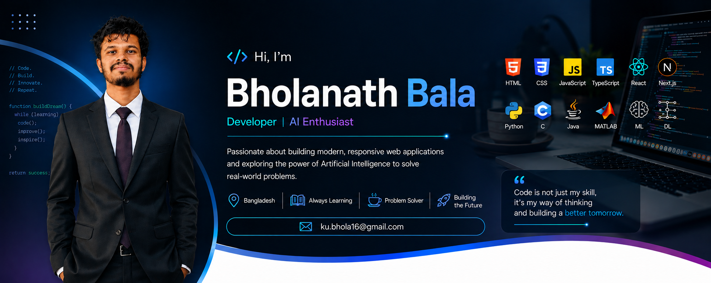

  

<h1 align="center">
  Hi 👋, I'm Bholanath Bala
</h1>

  <strong>AI Engineer in Progress • Software Developer • ECE Graduate</strong>

  

  

  

  

  

<h2>👨‍💻 About Me</h2>

  I'm an <strong>Electronics & Communication Engineering (ECE) graduate</strong>
  with a strong interest in <strong>Artificial Intelligence, Machine Learning,
  and Software Development</strong>.

  I enjoy combining my engineering background with modern software technologies
  to build practical solutions and explore real-world AI applications.

<ul>
  <li>🔭 Currently working on <strong>Web Development and AI projects</strong></li>
  <li>🌱 Currently learning <strong>JavaScript, TypeScript, React.js, and modern AI technologies</strong></li>
  <li>🤖 Interested in <strong>Artificial Intelligence, Machine Learning, Computer Vision, and Data Science</strong></li>
  <li>💻 Building practical projects with <strong>HTML, CSS, JavaScript, React, TypeScript, and Python</strong></li>
  <li>🧠 Interested in solving real-world problems through <strong>AI + Software Engineering</strong></li>
  <li>👯 Open to collaborating on <strong>AI, Machine Learning, and Web Development projects</strong></li>
  <li>🔬 Interested in <strong>AI research and emerging technologies</strong></li>
  <li>📄 <a href="./CV_Bholanath_Bala.pdf"><strong>View My Resume</strong></a></li>
  <li>📫 Reach me at <strong>ku.bhola16@gmail.com</strong></li>
</ul>

<h2>🔬 Research & Academic Work</h2>

<h3>📌 Bearing Fault Diagnosis Using Transformers</h3>

  My undergraduate thesis focused on applying
  <strong>Transformer-based deep learning models</strong>
  to automated bearing fault diagnosis.

  <strong>Title:</strong> <strong> Comparative Study of Vision Transformers and Time-Series Transformers
    for Bearing Fault Diagnosis Using PU Dataset
  </strong>

The study explored:

<ul>
  <li>🖼️ <strong>Vision Transformer (ViT)</strong></li>
  <li>📈 <strong>PatchTST — Patch Time Series Transformer</strong></li>
  <li>🔊 Vibration-signal based fault diagnosis</li>
  <li>🧠 Transformer-based representation learning</li>
  <li>📊 Classification performance evaluation</li>
</ul>

<h3>📊 Key Result</h3>

  The study achieved a
  <strong>weighted F1-score of 0.9928</strong> and
  <strong>99.28% classification accuracy</strong>
  on the PU bearing dataset.

  <strong>Research Interests:</strong> 
  <code>Artificial Intelligence</code> •
  <code>Deep Learning</code> •
  <code>Transformers</code> •
  <code>Computer Vision</code> •
  <code>Time-Series Analysis</code> •
  <code>Predictive Maintenance</code>

<h2>📄 Publications</h2>

<h3>📝 IEEE ICCIT 2025</h3>

  Part of my research work was published at the
  <strong>IEEE International Conference on Computer and Information Technology (ICCIT 2025)</strong>.

  <strong>📌 Paper Title: </strong><
  <strong>
    Vision Transformer-Based Classification of Bearing Faults from
    Vibration Signal Spectrograms
  </strong>

  <strong>🔗 IEEE Xplore:</strong>
  <a href="https://ieeexplore.ieee.org/document/11490241/" target="_blank">
    View Publication
  </a>

<h3>📝 IEEE PECCII 2026</h3>

  Published at the
  <strong>
    2026 International Conference on Power, Electronics, Communications,
    Computing, and Intelligent Infrastructure (PECCII)
  </strong>, IEEE.

  <strong>📌 Paper Title: </strong>
  <strong>
    A Novel Attention-Enhanced Hybrid Deep Learning Model for GI Disease Classification
  </strong>

  <strong>🔗 IEEE Xplore:</strong>
  <a href="https://ieeexplore.ieee.org/document/11661820" target="_blank">
    View Publication
  </a>

<h2>🚀 Featured Projects</h2>
<h3>🌐 DevConf 2026</h3>

  A modern and responsive <strong>developer conference landing page</strong>
  designed for DevConf 2026.

<strong>Highlights:</strong>

<ul>
  <li>Responsive conference website</li>
  <li>Hero section</li>
  <li>Speaker information</li>
  <li>Ticket pricing</li>
  <li>Hackathon section</li>
  <li>Event information</li>
  <li>Modern and clean user interface</li>
</ul>

  <strong>Tech:</strong>
  <code>HTML</code> • <code>CSS</code>

  🔗 <strong>Live Demo: </strong><a href="https://bhola16.github.io/MyAssignment_01/" target="_blank">
    https://bhola16.github.io/MyAssignment_01/
  </a>

<h3>🍽️ Spice Haven</h3>

  A modern and responsive <strong>restaurant website</strong>
  designed to provide an attractive online presence for a fictional
  restaurant brand.

<strong>Highlights:</strong>

<ul>
  <li>Responsive restaurant layout</li>
  <li>Attractive hero section</li>
  <li>Food and menu presentation</li>
  <li>Restaurant information</li>
  <li>Clean and modern UI</li>
  <li>Mobile-friendly design</li>
</ul>

  <strong>Tech:</strong>
  <code>HTML</code> • <code>CSS</code>

  🔗 <strong>Live Demo: </strong><a href="https://bhola16.github.io/Spice_Haven_Restaurant/" target="_blank">
    https://bhola16.github.io/Spice_Haven_Restaurant/
  </a>

<h3>🎓 University Certificate Automation System</h3>

  A web-based <strong>university certificate automation system</strong>
  developed as a team project. I was responsible for the
  <strong>frontend development</strong>, while my teammates handled the
  backend and data management.

<strong>Highlights:</strong>

<ul>
  <li>🎨 <strong>Frontend Development</strong> — Designed and developed the user interface for the certificate automation system</li>
  <li>💻 <strong>User-Friendly Interface</strong> — Created a clean and intuitive web-based interface for users</li>
  <li>📱 <strong>Responsive Design</strong> — Developed responsive layouts that work across different screen sizes</li>
  <li>🧩 <strong>Reusable Components</strong> — Built and organized reusable frontend components for a consistent UI</li>
  <li>🔗 <strong>Backend Integration</strong> — Connected the frontend with backend functionality developed by team members</li>
  <li>🤝 <strong>Team Collaboration</strong> — Collaborated with teammates responsible for backend development and data management</li>
</ul>

  <strong>Tech:</strong>
  <code>React.js</code> •
  <code>JavaScript</code> •
  <code>HTML</code> •
  <code>CSS</code>

  

<h2>🧰 Tech Stack</h2>

<h3>💻 Programming Languages</h3>

  &nbsp;&nbsp;&nbsp;

  &nbsp;&nbsp;&nbsp;

  &nbsp;&nbsp;&nbsp;

  &nbsp;&nbsp;&nbsp;

  &nbsp;&nbsp;&nbsp;

  

<h3>🌐 Web Development</h3>

  &nbsp;&nbsp;&nbsp;

  &nbsp;&nbsp;&nbsp;

  &nbsp;&nbsp;&nbsp;

  &nbsp;&nbsp;&nbsp;

  &nbsp;&nbsp;&nbsp;

  

<h3>🤖 AI & Machine Learning</h3>

  &nbsp;&nbsp;&nbsp;

  &nbsp;&nbsp;&nbsp;

  &nbsp;&nbsp;&nbsp;

  &nbsp;&nbsp;&nbsp;

  

<h3>🗄️ Databases</h3>

  &nbsp;&nbsp;&nbsp;

  

<h3>🛠️ Tools & Technologies</h3>

  &nbsp;&nbsp;&nbsp;

  &nbsp;&nbsp;&nbsp;

  

<h2>📊 GitHub Analytics</h2>

  
  &nbsp;&nbsp;&nbsp;&nbsp;
  

<h2>🎯 Current Focus</h2>

I'm currently focusing on strengthening my skills in:

<ul>
  <li>🧠 Machine Learning & Deep Learning</li>
  <li>🤖 Artificial Intelligence</li>
  <li>📊 Data Science</li>
  <li>🌐 Frontend Development</li>
  <li>🏗️ Software Engineering</li>
  <li>🔬 AI Research</li>
  <li>🚀 Building practical and production-oriented projects</li>
</ul>

<h2>📚 Areas of Interest</h2>

  <code>Artificial Intelligence</code>
  <code>Machine Learning</code>
  <code>Deep Learning</code>
  <code>Computer Vision</code>
  <code>Transformers</code>
  <code>Data Science</code>
  <code>Time-Series Analysis</code>
  <code>Software Development</code>
  <code>Web Development</code>
  <code>AI Applications</code>

<h3 align="left">🔗 Connect with Me:</h3>

  &nbsp;&nbsp;&nbsp;&nbsp;

  

  

  <b>Thank you for visiting my profile! 🙏</b>
   
  I appreciate your time and interest.

  ⭐ If you find any of my projects interesting, feel free to star or contribute!

